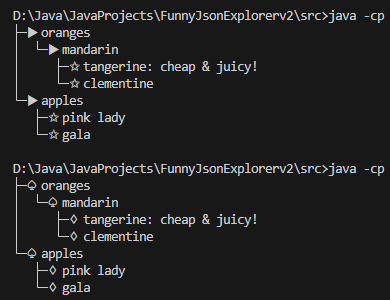
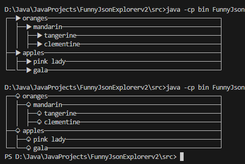

# FJE_v2——迭代器模式和策略模式

## 实验要求

在上次实现的基础上，对FJE进行设计重构：改用下面一种架构

- 迭代器+访问者模式
- 迭代器+策略模式

## 实验流程

在本次实验中我使用的是迭代器+策略模式，新设计方案的UML图如下：

### 迭代器模式

在实现中，**我新增加了迭代器类`NodeInterator`负责用于迭代我们通过`load`函数建成的树形结构，由于这里我们只有深度优先搜索的迭代需求，我就没有将Iterator设置成抽象类然后再实现两个concrete的迭代器类，在这里只需一个iterator类即可**，Style类通过使用iterator类来遍历我们的树形结构

### 策略模式

`Style`类是策略模式中的`Strategy`类，而`TreeStyle`和`RectangleStyle`类是具体的策略类，不同的策略类执行`draw`方法（对应策略模式中`execute`方法）实现不同的绘制逻辑

## 结果展示

### 树形结构

### 矩形结构

实现源码请参考GitHub链接https://github.com/SteveOUO/Funny-Json-Explorer-v2